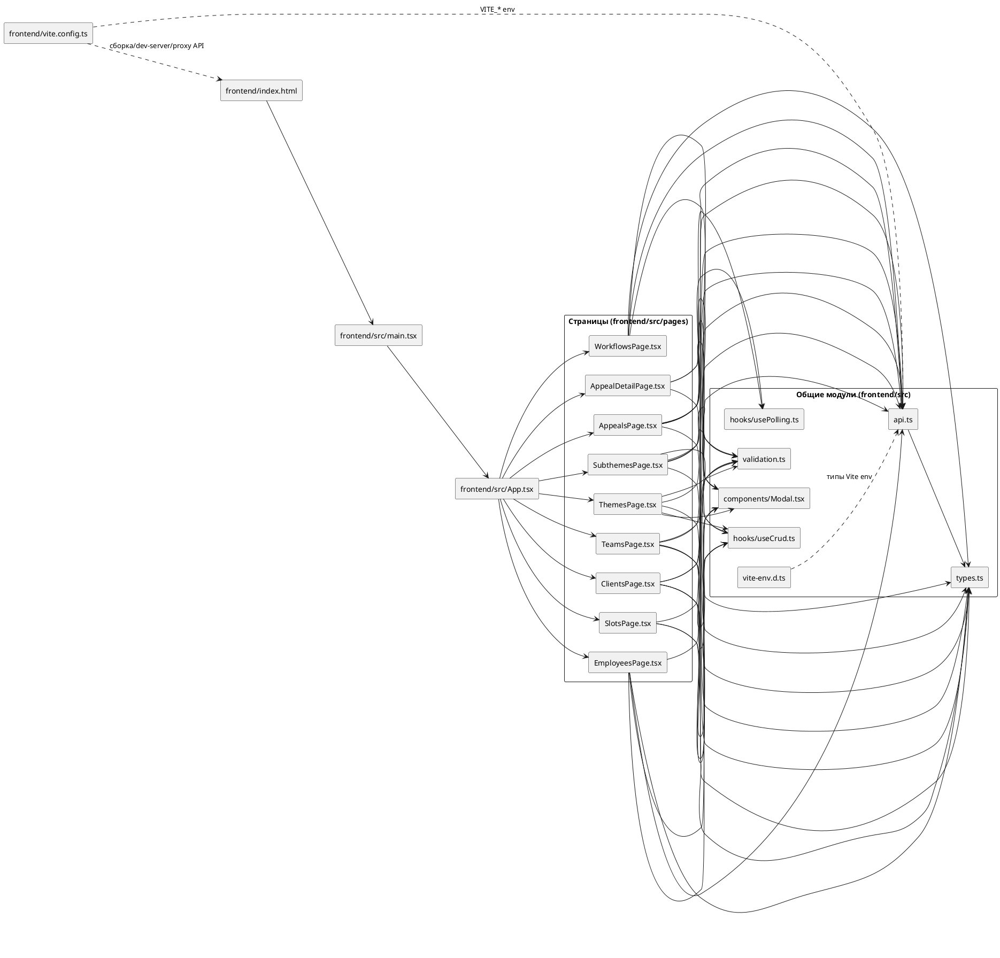

# Диаграмма компонентов frontend

## Зависимости файлов

## Описание файлов frontend

| Файл | Описание | Зависит от | Используется в |
|---|---|---|---|
| `frontend/index.html` | HTML-входная точка SPA, содержит контейнер `#root` и подключает `src/main.tsx`. | - | Браузер, Vite/serve |
| `frontend/package.json` | NPM-манифест проекта: скрипты (`dev`, `build`, `preview`) и зависимости React/Vite/TS. | - | npm, Vite, TypeScript |
| `frontend/package-lock.json` | Зафиксированное дерево npm-зависимостей для воспроизводимых установок. | `package.json` | npm |
| `frontend/tsconfig.json` | Конфигурация TypeScript (strict mode, JSX, include `src`). | - | TypeScript, Vite |
| `frontend/vite.config.ts` | Конфиг сборщика Vite: React-плагин, порт dev-сервера и proxy на backend. | `@vitejs/plugin-react` | Vite |
| `frontend/README.md` | Документация по запуску, структуре проекта и API-слою фронтенда. | - | Разработчики |
| `frontend/src/main.tsx` | React-entrypoint: создаёт root и оборачивает `App` в `BrowserRouter`. | `App.tsx` | `index.html` |
| `frontend/src/App.tsx` | Корневой layout с sidebar и маршрутизацией на все страницы приложения. | Все файлы из `src/pages` | `main.tsx` |
| `frontend/src/api.ts` | Единый HTTP-слой (`fetch` + CRUD API-объекты по сущностям). | `types.ts`, `vite-env` (`import.meta.env`) | Почти все страницы |
| `frontend/src/types.ts` | Набор TypeScript-интерфейсов доменных сущностей и workflow-структур. | - | `api.ts`, страницы |
| `frontend/src/validation.ts` | Общие правила валидации текстовых/числовых/email полей и helper для форм. | - | Страницы с формами |
| `frontend/src/vite-env.d.ts` | Типизация `ImportMetaEnv` (в частности `VITE_API_URL`) для TypeScript. | `vite/client` types | `api.ts`, TypeScript |
| `frontend/src/hooks/useCrud.ts` | Универсальный CRUD-хук: загрузка списка, create/update/remove, обработка ошибок. | React hooks | Большинство CRUD-страниц |
| `frontend/src/hooks/usePolling.ts` | Хук short-polling для периодического обновления данных по таймеру. | React hooks | `AppealsPage.tsx`, `AppealDetailPage.tsx` |
| `frontend/src/components/Modal.tsx` | Переиспользуемый модальный контейнер для create/edit форм. | React | Большинство страниц |
| `frontend/src/pages/EmployeesPage.tsx` | CRUD-страница сотрудников, включая привязку к командам и валидацию формы. | `api.ts`, `useCrud.ts`, `Modal.tsx`, `types.ts`, `validation.ts` | `App.tsx` |
| `frontend/src/pages/ClientsPage.tsx` | CRUD-страница клиентов с формой и поддержкой VIP-признака. | `api.ts`, `useCrud.ts`, `Modal.tsx`, `types.ts`, `validation.ts` | `App.tsx` |
| `frontend/src/pages/ThemesPage.tsx` | CRUD-страница тем обращений. | `api.ts`, `useCrud.ts`, `Modal.tsx`, `types.ts`, `validation.ts` | `App.tsx` |
| `frontend/src/pages/SubthemesPage.tsx` | CRUD-страница подтем обращений. | `api.ts`, `useCrud.ts`, `Modal.tsx`, `types.ts`, `validation.ts` | `App.tsx` |
| `frontend/src/pages/SlotsPage.tsx` | Страница просмотра слотов сотрудников с фильтром по сотруднику. | `api.ts`, `useCrud.ts`, `types.ts` | `App.tsx` |
| `frontend/src/pages/AppealsPage.tsx` | Страница списка обращений: фильтр, модалки create/edit, polling и переход в детали. | `api.ts`, `useCrud.ts`, `usePolling.ts`, `Modal.tsx`, `types.ts`, `validation.ts` | `App.tsx` |
| `frontend/src/pages/AppealDetailPage.tsx` | Детальная страница обращения с автообновлением и действием закрытия обращения. | `api.ts`, `usePolling.ts`, `types.ts` | `App.tsx`, роут `/appeals/:id` |
| `frontend/src/pages/TeamsPage.tsx` | CRUD-страница команд с управлением связями тема/подтема/VIP. | `api.ts`, `useCrud.ts`, `Modal.tsx`, `types.ts`, `validation.ts` | `App.tsx` |
| `frontend/src/pages/WorkflowsPage.tsx` | Конструктор и CRUD автоматизаций workflow (условия, действия, сериализация узлов). | `api.ts`, `Modal.tsx`, `types.ts`, `validation.ts` | `App.tsx` |

